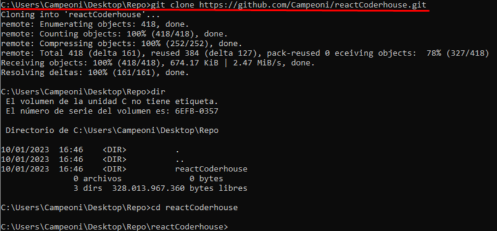
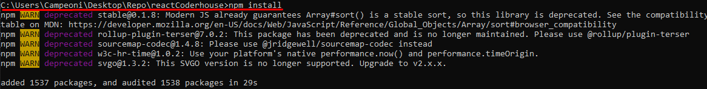
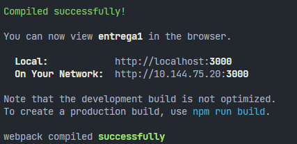
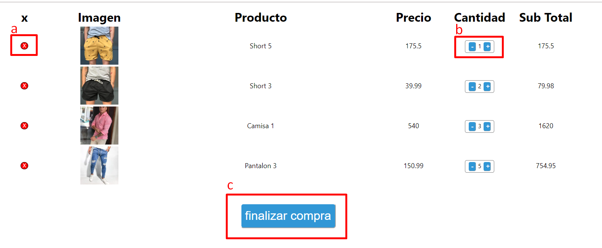
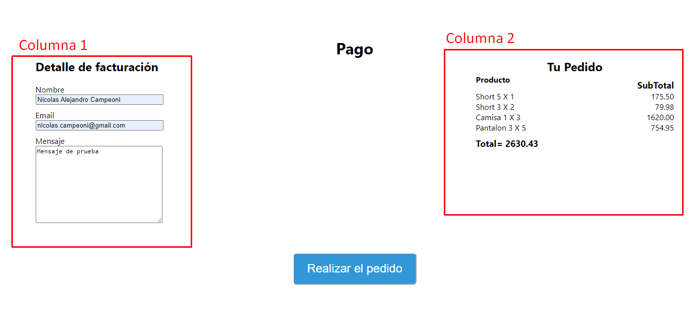
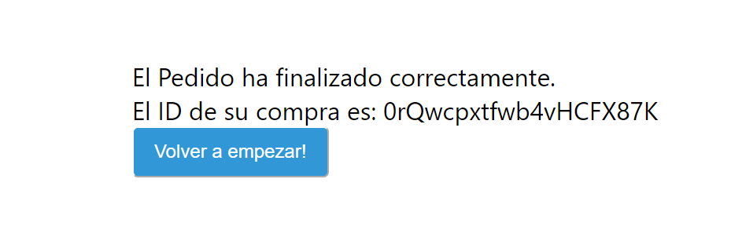

# Tienda Online "Lisboa"

Este es un proyecto que simula las funcionalidades básicas de una tienda online.
 
1. Disposición de artículos con diferentes filtros
 
2. Manipular carrito: 
>- Agregar Artículo
>- Sacar Artículo
>- Modificar cantidad de/los artículos
 
3. CheckOut de la compra, donde la misma finaliza mostrando un código único de la orden de compra.  
---
# Levantar el proyecto de manera local
Se asume que se tiene instalado node y npm de manera local.

## 1. Clonar el proyecto a nuestra maquina
Desde una terminal nos posicionamos en la carpeta donde queremos clonar el proyecto y ejecutamos la siguientes lineas de comando:

``` console
git clone https://github.com/Campeoni/reactCoderhouse.git
```



## 2. Instalar dependencias del proyecto
Nos posicionamos en la carpeta generada al agregar el proyecto y ejecutamos

``` console
npm install
```


## 3. Ejecutar el proyecto
Desde una terminal posicionados en el proyecto y habiendo instalado las dependencias necesarias para el correcto funcionamiento del proyecto ejecutamos:
``` console
npm start
```
Esto completará el mismo y lo levantará localmente. Por defecto suele levantarlo en el puerto 3000 como se puede ver en la imagen.



---
# Funcionalidades básicas
La misma cuenta con las siguientes URL de navegación principal y sus respectivas funcionalidades. Se asume en los ejemplos que se está usando el socket "localhost:3000".

## 1. Home
Presionando el Logo principal (LISBOA) ó en la URL "http://localhost:3000/". Mostrará todos los artículos.

## 2. Ofertas
Presionando en el link de "Ofertas" o en la URL "http://localhost:3000/Ofertas". Mostrará los artículos que están en oferta. 
## 3. Categorías
Presionando en los links de las diferentes categorías o en la URL "http://localhost:3000/Categorias/*nroCategoria*" (Ejemplo para remeras "http://localhost:3000/Categorias/1"). Muestra los artículos de la categoría a la cual corresponde.

## 4. Articulo
Cuando seleccionamos un artículo nos muestra una imagen más detallada y algunas funcionalidades:
### a. Seleccionar cantidad del articulo
El mismo permite seleccionar como base 1 y no permite que sea menor a esa cantidad ni mayor a la cantidad disponible del mismo.

### b. Agregar al carrito
Con este botón podremos agregar al carrito este artículo con la cantidad seleccionada. Es importante saber que si el artículo ya está en el carrito al presionar el botón actualizaremos el artículo con la cantidad seleccionada.
## 5. CardWidget 
Presionando en el carrito o en la URL "http://localhost:3000/Order". Nos mostrará un detalle del carrito. En caso de no tener ningún artículo, mostrará un mensaje informando que no existe ningún producto.
 
Si tiene artículos veremos cada uno separados en filas con las siguientes columnas:


|X|imagen|producto|precio|cantidad|sub Total|
|-|------|--------|------|--------|---------|
|boton para eliminar|imagen | nombre| precio individual| cantidad| precio total|

Donde existen las siguientes funcionalidades:


### a. Boton para elimiar el articulo
Veremos un botón al principio de la fina en color rojo. Este permite sacar el artículo del carrito.

### b. Administrar la cantidad del articulo
En caso que se quiere modificar la cantidad de dicho artículo se puede hacer en la fila de cantidad. Donde tendremos 1 botón para disminuir '-' y otro para sumar '+'. El mismo no permite que sea menor a 1 ni mayor a la cantidad disponible de dicho artículo.

### c. Boton para finalizar compra
Este botón sólo estará habilitado si existe algún artículo en el carrito. Nos llevará a la URL "http://localhost:3000/Checkout".

## 5. CheckOut
En está pantalla esta dividida en 2 columnas y un botón para finalizar la compra. 



### a. Columna 1 
En esta columna están los "Detalles de la facturación" que sirven para identificar los datos del comprador. La misma consta de 3 campos:

- Nombre 
- Email
- Mensaje
### b. Columna 2 
En esta columna está el detalle del pedido.

### c. Boton "Realizar el pedido"
Este botón solamente estará activo si los 3 campos solicitados en el detalle de compra están completos. En caso contrario no se mostrará.
 
Al presionar este botón daremos por finalizada la compra. Nos llevará a una pantalla donde indicará que el pedido ha finalizado con éxito y nos mostrará el ID de nuestra compra. También habrá un botón para volver a empezar.



---
# Tener en cuenta 
* En el menú principal hay links que son a modo de demostrativos y no tienen ningún contenido ni propósito funcional.
   * Quienes somos
   * FAQ
   * Mi cuenta
* Los botones de las redes sociales son solamente a modo ilustrativo para completar con info el footer. Los mismos no son funcionales.